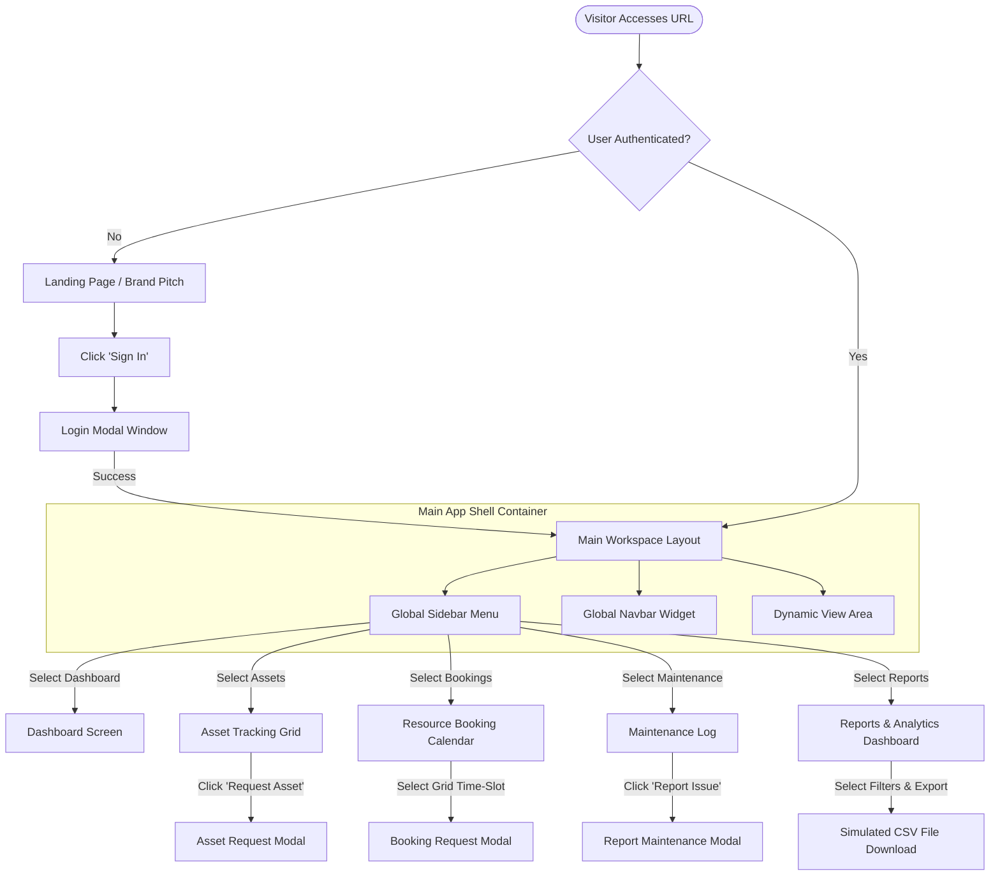
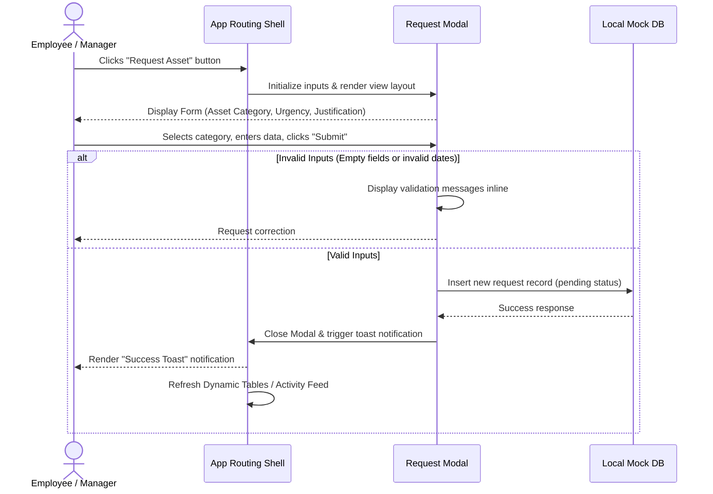
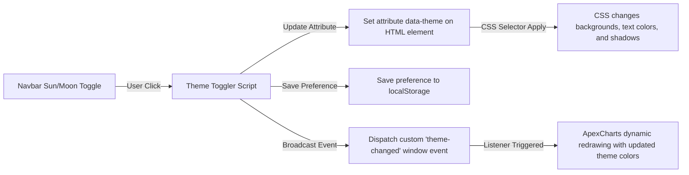

# App Flow - AssetFlow

This document details the navigation flows, modal workflows, page-level routing rules, and structural wireframe layouts for the AssetFlow application using Mermaid diagrams.

---

## 1. Global Navigation Architecture

The diagram below details the screen transitions, user authentication entry, and page swapping architecture within the Single Page Application framework:



---

## 2. Interactive Flow Workflows

### 2.1. Requesting an Asset Flow
This diagram maps out the client-side state machine handling field validation, UI states, and confirmation alerts during an asset request:



### 2.2. Theme Toggling Event Pipeline
This diagram displays how CSS variables and JS-based chart redraws handle Light and Dark themes simultaneously:



---

## 3. UI Layout & Grid Wireframe Spec

Below is the layout wireframe showing how the layout handles desktop resolutions:

```
+----------------------------------------------------------------------------------------+
|                                      GLOBAL NAVBAR                                     |
| [Logo] [Menu Toggle]    [Breadcrumbs: Assets > Grid]         (Notifications) (Avatar)  |
+------------------+---------------------------------------------------------------------+
|                  |                                                                     |
|  GLOBAL SIDEBAR  |  MAIN VIEWS CONTAINER                                               |
|                  |  +---------------------------------------------------------------+  |
|  [D] Dashboard   |  | PAGE HEADER & PRIMARY ACTION BUTTON                           |  |
|  [A] Asset Grid  |  +---------------------------------------------------------------+  |
|  [B] Bookings    |  |                                                               |  |
|  [M] Maintenance |  |  +---------------------+ +-----------------+ +-------------+  |  |
|  [R] Reports     |  |  | KPI Card: Available | | KPI Card: Alloc | | Card: Maint |  |  |
|                  |  |  +---------------------+ +-----------------+ +-------------+  |  |
|                  |  |                                                               |  |
|                  |  |  +-------------------------------------+ +-----------------+  |  |
|                  |  |  | Main Content: Datatable / Calendar  | | Side Chart Pane |  |  |
|                  |  |  |                                     | |                 |  |  |
|                  |  |  |                                     | |                 |  |  |
|                  |  |  +-------------------------------------+ +-----------------+  |  |
|                  |  +---------------------------------------------------------------+  |
|  [Collapse <]    |                                                                     |
+------------------+---------------------------------------------------------------------+
```
*Note: In tablet layouts, the global sidebar collapses to icons-only. In mobile screens, it transforms into an off-canvas overlay drawer toggled via the navbar burger menu icon.*
